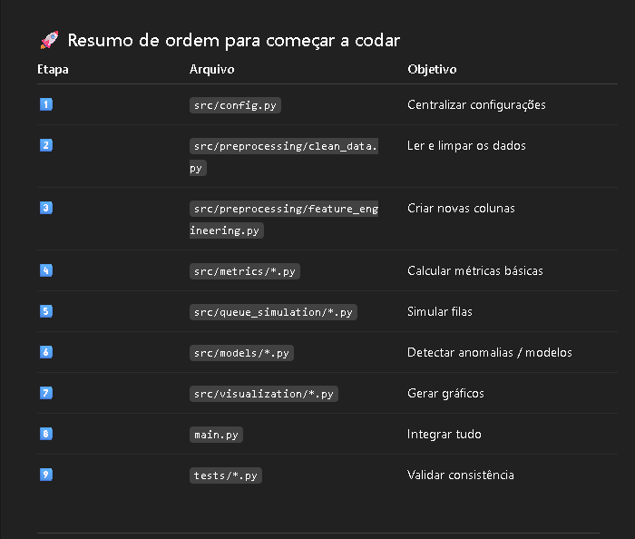

# 🧠 Projeto de Simulação de Sistema de Login (2FA)
## 🎯 Objetivo do Projeto

Este projeto tem como objetivo analisar e simular o comportamento de um sistema de login com autenticação em dois fatores (2FA), avaliando métricas de desempenho, taxas de sucesso, falhas de autenticação, detecção de anomalias e modelagem de filas de requisições.

A proposta é reproduzir, de forma controlada, o funcionamento de um ambiente de autenticação real, permitindo estudar aspectos de segurança, desempenho e comportamento de usuários.

💡 Observação: Toda a base de dados já está pronta e se encontra no arquivo data/raw/simulacao_login_dataset1.xlsx.

O trabalho é dividido em etapas de engenharia de dados, ciência de dados e simulação computacional.

## 🎯 1. Objetivo do Documento

Este guia tem como finalidade orientar a equipe de desenvolvimento sobre como estruturar, implementar e analisar o projeto de simulação de um sistema de login com autenticação em duas etapas (2FA).
O foco é didático: compreender as etapas de simulação, coleta de métricas e análise de desempenho.
O documento não contém código, apenas especificações, estrutura e etapas a seguir.

# 📁 2. Estrutura de Pastas do Projeto

```plaintext
simulacao_login/
│
├── data/                       
│   ├── raw/                    
│   │   └── simulacao_login_dataset1.xlsx   # Base original fornecida (dados brutos)
│   ├── processed/              
│   │   └── simulacao_login_dataset1_processed.csv  # Dados limpos e tratados
│
├── src/                        
│   ├── __init__.py
│   ├── config.py               # Parâmetros gerais: caminhos, seeds, configurações de ambiente
│
│   ├── preprocessing/           # Limpeza e preparação dos dados
│   │   ├── __init__.py
│   │   ├── clean_data.py        # Remoção de duplicatas, valores ausentes e formatação de colunas
│   │   └── feature_engineering.py # Criação de colunas derivadas (ex: tempo de resposta, hora do login)
│
│   ├── queue_simulation/        # Modelagem matemática da fila de logins
│   │   ├── __init__.py
│   │   ├── mm1_queue.py         # Implementação do modelo M/M/1
│   │   └── mmc_queue.py         # Implementação do modelo M/M/c
│
│   ├── metrics/                 # Cálculo de métricas e indicadores
│   │   ├── __init__.py
│   │   ├── success_rate.py      # Cálculo de taxa de sucesso e falhas de login
│   │   ├── latency_metrics.py   # Estatísticas de tempo de resposta
│   │   └── anomaly_detection.py # Identificação de picos e comportamentos anormais
│
│   ├── models/                  # Algoritmos de aprendizado ou clusterização
│   │   ├── __init__.py
│   │   ├── clustering.py        # Agrupamento de padrões de login (ex: usuários, IPs)
│   │   └── predictive_model.py  # Modelo preditivo simples (ex: probabilidade de falha)
│
│   └── visualization/           # Gráficos e relatórios visuais
│       ├── __init__.py
│       └── plot_kpis.py         # Visualização de métricas e comparações
│
├── tests/                      
│   ├── __init__.py
│   ├── test_preprocessing.py    # Testes dos scripts de limpeza
│   ├── test_metrics.py          # Testes das funções de cálculo de métricas
│   └── test_models.py           # Testes de funcionamento dos modelos
│
├── docs/                        # Documentação do projeto
│   ├── README.md                # Descrição geral e instruções de uso
│   └── passo_a_passo.md         # Guia prático para execução e entendimento do projeto
│
├── requirements.txt             # Lista de dependências Python
└── main.py                      # Ponto de entrada principal do projeto
```

- 📘 Mesmo com a base já pronta, essas distribuições podem ser aplicadas para análise e modelagem dos dados existentes, não para geração de novos.

## 🔢 3. Conceitos Estatísticos Utilizados
´´´
| Conceito               | Fórmula                                        | Aplicação no Projeto                                     |
| ---------------------- | ---------------------------------------------- | -------------------------------------------------------- |
| **Poisson**            | ( P(X=k) = \frac{e^{-\lambda} \lambda^k}{k!} ) | Estimar o número médio de logins por intervalo de tempo  |
| **Exponencial**        | ( f(x;\lambda) = \lambda e^{-\lambda x} )      | Calcular o tempo médio entre tentativas de login         |
| **Normal / Lognormal** | —                                              | Modelar tempos de autenticação ou latência (cauda longa) |
| **Binomial / Poisson** | —                                              | Simular número de tentativas até o sucesso do login      |

## ⚙️ 4. Pipeline de Execução

### Pré-processamento dos dados

- Ler o arquivo simulacao_login_dataset1.xlsx

- Tratar valores ausentes, converter timestamps e padronizar colunas.

- Salvar a versão limpa em data/processed/.

### Modelagem da fila de autenticação

- Aplicar modelos M/M/1 e M/M/c com base na taxa de chegada (λ) e tempo de serviço (μ).

- Estimar o tempo médio de espera e nível de congestionamento.

### Cálculo de métricas

- Taxa de sucesso de login

- Latência média

- Retries por usuário

- Taxa de bloqueios ou falhas

### Detecção de anomalias

- Identificar padrões anormais de login (IPs suspeitos, tentativas excessivas, horários atípicos).

### Visualização dos resultados

- Gerar gráficos de desempenho e relatórios com KPIs principais.

### Validação

- Executar testes unitários e revisar consistência das análises.



## 📊 5. Métricas-Chave do Projeto
´´´
| Métrica                         | Descrição                                                   |
|----------------------------------|-------------------------------------------------------------|
| Taxa de sucesso de login (%)     | Percentual de logins concluídos com sucesso                 |
| Tempo médio de autenticação (ms) | Média, mediana e percentis (p95, p99)                       |
| Retries por sessão               | Quantidade média de tentativas antes do sucesso             |
| Taxa de bloqueio (captcha/lockout) | Percentual de logins bloqueados                            |
| Tempo médio de fila (M/M/1)      | Tempo esperado de espera para autenticação                  |
| Taxa de eventos anômalos         | Proporção de IPs/usuários suspeitos detectados              |

´´´

## 🧩 6. Modelos e Técnicas Sugeridas

- Teoria das Filas:
-- M/M/1 (fila única) e M/M/c (múltiplos servidores).

- Detecção de Anomalias:
-- Isolation Forest, Local Outlier Factor, Z-score.

- Classificação e Predição:
-- Random Forest, XGBoost.

- Clusterização:
-- KMeans e DBSCAN.

- Simulação Monte Carlo:
-- Avaliar robustez do sistema variando parâmetros, por exemplo: aumentar λ em +20% e observar impacto no tempo médio de fila..